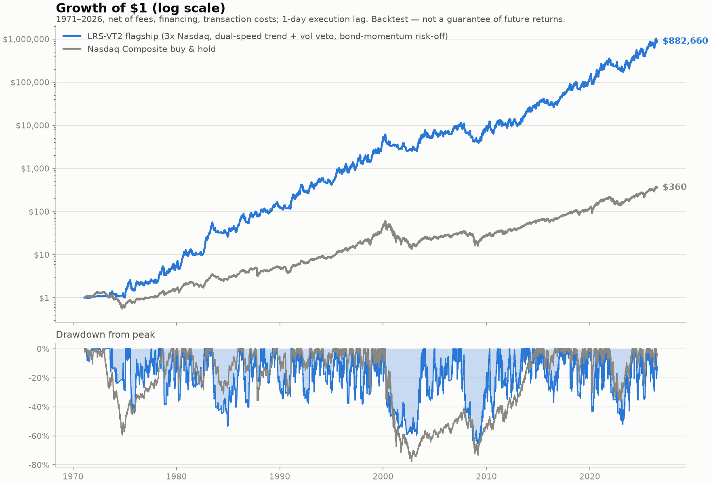

# QuantLab — open-source systematic investing research engine

A free, transparent Python engine that reproduces — and stress-tests — strategies
from published, peer-reviewed investment research. What hedge funds sell as a
black box, this repo shows as ~400 lines of readable code with every assumption
disclosed.



## Headline result

**The flagship "LRS-VT2" strategy compounded at 28.0%/year for 55 years
(1971–2026) in backtest** — net of fund fees, financing costs, transaction
costs, and a 1-day execution lag. Its predecessor LRS-VT (25.4%/yr, simpler,
lower drawdown) remains in the results as the conservative baseline. In the
honest test — the decade *after* the core paper was published (2016–2026) —
LRS-VT2 compounded at 41.9%/yr on the Nasdaq Composite.

**Why v2:** trend filters lag V-shaped rebounds (Jan 2019, Apr 2020, Jan
2023), and at 3x leverage those first weeks off the bottom are most of the
gap to buy & hold. v2 adds three literature-standard fixes — risk-off only
below BOTH the 50d and 200d SMA (two-speed ladder), volatility scaling only
when 20d vol exceeds 1.25x long-run vol (conditional vol management, cf.
Cederburg et al. 2020), and absolute momentum on the defensive leg (UST10 vs
T-bills, Antonacci) which sidesteps 2022-style joint stock/bond selloffs.
On the TQQQ asset (3x Nasdaq-100, 2010–2026) this cuts the wealth gap to
buy & hold from 3.5x to 2.05x while keeping the dot-com decade POSITIVE
(+8.4%/yr vs -49%/yr for 3x B&H). Full disclosure: the v2 refinements were
developed while studying that 2010–2026 gap, so treat their edge over v1
with the usual out-of-sample humility; they do hold across the S&P 500,
Nasdaq Composite, and Nasdaq 100 over 40-76 years.

## Cutting drawdowns: the Defense frontier

Diagnosis of the deep drawdowns showed two mechanisms: crashes that begin
ABOVE the 200d SMA (April 2000 fell 25% before touching the exit line after a
parabolic run) and multi-year bears ground out at partial exposure. Two fixes,
plus the mathematically efficient blend:

| Config (Nasdaq Comp, 1971–2026) | CAGR | MaxDD | Worst yr | Sharpe |
|---|---|---|---|---|
| LRS-VT2 | 28.0% | -66.6% | -41.7% | 0.75 |
| **LRS-Defense** (warning rung 0.5 + extension cap 0.25) | **30.2%** | **-60.2%** | -37.8% | 0.85 |
| **60/40 Defense + bond-momentum** | 21.9% | **-36.9%** | -22.9% | **0.89** |

On the Nasdaq-100 (TQQQ) the 60/40 blend halves max drawdown outright
(-77% → -37.5%). Sharpe RISES along this frontier — blending with the
defensive leg is the efficient way to buy drawdown reduction. Signal-level
alternatives tested and rejected: re-entry throttling (made drawdowns worse —
mid-bear rallies are net cushioning), equity-curve governors (halve DD but
collapse CAGR to 12-18% by staying de-levered through recoveries), per-stint
stops (mechanically redundant below the fast SMA). The bond frontier costs
~2pp CAGR per 6pp of drawdown reduction.

**LRS-Fortress beats that frontier by adding a second return source: gold.**
70% [LRS-Defense equity with a gold-augmented defensive rotation (risk-off
money goes to the stronger of UST10/gold by 12m momentum, else T-bills)] +
30% [2x gold-trend sleeve (Faber 2007 rule; implementable via UGL)]. Gold is
the crisis asset that carried 2000-03 and the 1970s. Result on the Nasdaq
Composite, 1971–2026: **28.0% CAGR (identical to LRS-VT2), max drawdown
-49.3% (vs -66.6%), Sharpe 0.94 (vs 0.75)**, worst year -34.0% (vs -41.7%),
and every drawdown episode in 55 years below -50% (2008: -49.3%, recovered in
10 months). Gold data: LBMA monthly pre-2001 (sleeve smoothing never touches
a drawdown episode — all lie in the daily-futures era), COMEX daily after.
Caveats: the Nasdaq-100 version still reaches -53.6% (dot-com is crueler
there); the config was assembled studying the very crises it defends against,
so out-of-sample humility applies — though its OOS decade (2016+) delivered
31.8% at -47.2%.

## The other direction: LRS-Sentinel (a hard drawdown budget)

Every config above maximises growth and pays for it with -50% to -67%
drawdowns. `run_lowdd.py` inverts the objective: **cap max drawdown (default
budget: under 10%) and take the most CAGR that cap allows.**

Signal-level tightening cannot get there, and the reason is arithmetic rather
than opinion. A 3x fund fell ~61% on 1987-10-19 alone; entering that day at
zero drawdown, a 10% budget is already spent at a 16% weight in the fund — and
no daily signal reacts to an overnight gap. Only *sizing* can buy a budget
that tight, so LRS-Sentinel changes the construction on four axes at once:

| Mechanism | What it does | Source |
|---|---|---|
| Risk parity over three trend sleeves | Equity (3x, Defense signal), UST10 momentum and gold trend, each parking in T-bills when its own trend is off, weighted inverse-vol | Faber (2007) GTAA; Asness, Frazzini & Pedersen (2012) |
| Portfolio volatility target | Scale the whole book to a low target vol; drawdown scales roughly linearly with vol, so this does most of the work | Moreira & Muir (2017) |
| Drawdown governor (CPPI) | Cut exposure in proportion to the cushion left above a floor — the hard constraint | Black & Perold (1992); Grossman & Zhou (1993) |
| Stress (gap) cap | Cap exposure so a worst-case *overnight* move still fits the remaining budget — the governor reacts to realised drawdown and structurally cannot price a gap | standard stress limit |

The sleeves are deliberately kept pure: the equity sleeve parks in T-bills,
not gold, because the gold sleeve already holds that exposure — letting both
hold it would double-count gold and corrupt the risk-parity weights.

**The cash-lock fix.** The earlier finding above — that equity-curve governors
"halve DD but collapse CAGR by staying de-levered through recoveries" — is
cash-lock: against an all-time high-water mark the floor never moves, so once
pinned you miss the rebound. Sentinel measures drawdown against a *rolling*
high-water mark (default 252 days) so an old peak ages out and the floor
decays, and enforces a minimum exposure so the book never fully locks to cash.

**No performance numbers are quoted here on purpose.** They were not measured —
the environment this was written in could not reach the price data. The code is
validated for mechanics (no look-ahead, the budget binds monotonically, vol
target lands, turnover stays ~1-3 round-trips/year), not for edge. Run
`python3 run_lowdd.py` to produce the real figures; it sweeps the risk settings
and prints the best CAGR that held inside the budget.

**Expect the honest answer to be modest, and read the cash caveat the run
prints.** A portfolio held to a sub-10% drawdown is structurally mostly
T-bills. T-bills paid double digits in the 1980s, so full-history CAGR for
this config is flattered by an interest-rate regime that no longer exists —
the run reports how much of the return was just cash, and the 2016+
out-of-sample row deserves far more weight than the full-history row.

## The strategy (every piece is published research)

| Component | Rule | Source |
|---|---|---|
| Asset | Nasdaq Composite via a 3x daily-reset leveraged fund (e.g. TQQQ tracks the Nasdaq-100 version) | Gayed & Bilello (2016) |
| Regime filter | Hold only when the index closes **above its 200-day SMA**; leverage compounds well in low-vol uptrends and destroys itself below the SMA | Gayed & Bilello, *Leverage for the Long Run* — 2016 Charles H. Dow Award |
| Volatility targeting | Scale the position by `min(1, σ_longrun / σ_20day)` — de-lever into vol spikes (1987, 2020) that hit while still above the SMA | Moreira & Muir (2017), *Volatility-Managed Portfolios*, Journal of Finance |
| Risk-off asset | 10-year Treasuries (not cash) when below the SMA — they rally in the flights-to-quality that coincide with equity crashes | Antonacci (2014); Faber (2007) |

No fitted parameters: 200-day SMA and 12-month momentum are the literature's
canonical values, and the vol target is the asset's own expanding historical
volatility (point-in-time, no look-ahead).

## Realism (what the backtest charges you)

- **0.95% expense ratio** and **T-bill + 0.50% financing** on the borrowed 2x
  notional — matches real 3x funds (UPRO/TQQQ); volatility decay emerges
  automatically from daily compounding.
- **10 bps transaction cost** per full switch (~6 switches/year).
- **1-day execution lag** on every signal — no trading on information you
  don't have yet.
- Simulated Treasury returns validated at **0.947 daily correlation** against
  the real IEF ETF (2002–2026), and slightly conservative.
- Dividend correction is conservative (Nasdaq +0.6%/yr vs its ~0.8–1.3%
  history), since Yahoo index series are price-only while leveraged funds'
  swaps earn total return.

## Run it

```bash
pip install pandas numpy yfinance matplotlib
python run_research.py
```

Outputs: full-history and out-of-sample tables for the complete
{index} × {leverage} × {strategy} matrix, decade-by-decade breakdown,
`results_*.csv`, and `chart_flagship.png`. Data is cached in `data_cache/`
after the first run.

## Read this before believing any of it

1. **A backtest is not a promise.** 25.4% is what the rules *would have*
   earned. Past performance does not guarantee future results — anyone
   claiming a guaranteed CAGR is lying to you.
2. **The drawdowns are real and brutal.** The flagship lost **-56% peak to
   trough** and **-30% in its worst year**. Most people cannot hold through
   that; selling at the bottom converts a paper drawdown into a permanent loss.
3. **Survivorship of the idea.** The US equity market is history's best
   performer; the same rules on other markets earned less. The 2016+
   out-of-sample window is the strongest evidence here, but it is one decade,
   and one that was kind to tech.
4. **Taxes are not modeled.** ~6 switches/year generates mostly short-term
   capital gains; in a taxable account results will be materially worse.
5. **Leveraged ETFs can behave badly** in ways daily simulation can't fully
   capture (gap opens through stops, financing spreads blowing out, fund
   closures).
6. **This is education and research, not investment advice.**

## Nifty 500 extension (India + local AI analyst)

`run_nifty500.py` applies the trend-filter research to **every Nifty 500
constituent** (NSE official list): buy & hold vs the 200-day SMA filter per
stock, idle cash at the Indian T-bill yield. Results are ranked and saved to
`results_nifty500.csv`, and a **local Ollama 7B model** (qwen2.5:7b) writes
the research commentary in `NIFTY500_REPORT.md` — fully free and offline; the
LLM narrates the engine's numbers, it never invents them. Extra caveat there:
today's constituent list means survivorship bias.

```bash
python run_nifty500.py                  # full Nifty 500 (default)
python run_nifty500.py niftymidcap150   # Nifty Midcap 150 only
# needs Ollama running with qwen2.5:7b pulled
```

## TradingView

`tradingview/LRS_VT.pine` implements the flagship live: open a **daily** chart
of the fund you'd trade (e.g. TQQQ), paste the script into the Pine Editor,
and it computes the regime on the underlying index, sizes the position by the
vol target, fills orders next bar (same 1-day lag as the backtest), and ships
alerts for risk-on / risk-off / rebalance. When risk-off it goes flat — park
real proceeds in T-bills/Treasuries yourself (SGOV/IEF).

`tradingview/LRS_Sentinel.pine` is the live panel for the drawdown-budgeted
book. Unlike the others it is an **indicator, not a `strategy()`** — Sentinel
holds three risky sleeves at once (TQQQ + IEF + gold) at shifting weights, and
a Pine strategy can only hold one symbol, so any strategy-tester number would
describe a different portfolio. Run it on a **daily** chart (NASDAQ:TQQQ is the
natural host, but every symbol is an explicit input, so the host is only a
canvas) and it prints a target weight for each sleeve plus cash, which limit is
currently binding, and the model book's drawdown against your budget. The
backtest stays `run_lowdd.py`.

`tradingview/LRS_India.pine` is the 1x Indian adaptation (no leveraged equity
ETFs exist in India) for NSE stocks, index ETFs and indices: two-speed trend
ladder validated on the Nifty Midcap 150 backtest (ladder median Sharpe 0.49
vs 0.43 for the plain 200d filter; beats B&H Sharpe on 54% of stocks), vol
veto default-off (marginal at 1x), liquid fund when risk-off.

## Project layout

```
quantlab/
  data.py            # yfinance loading + local CSV cache
  leverage.py        # daily-reset leveraged fund simulation (fees + financing)
  bonds.py           # constant-maturity Treasury total returns from yields
  strategies.py      # SMA regime, TSMOM, vol-managed regime (all lag-adjusted)
  backtest.py        # positions -> net returns (costs, defensive asset)
  metrics.py         # CAGR, Sharpe, Sortino, drawdown, decade breakdown
  report.py          # equity-curve + drawdown chart
  india.py           # Nifty 500 universe + bulk price download
  ollama_analyst.py  # local-LLM research commentary (Ollama)
  sentinel.py        # drawdown-budgeted book (risk parity + vol target + CPPI + gap cap)
run_research.py      # the US flagship research run
run_nifty500.py      # the Nifty 500 cross-sectional run
run_lowdd.py         # the low-drawdown (LRS-Sentinel) frontier run
```
